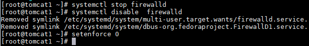
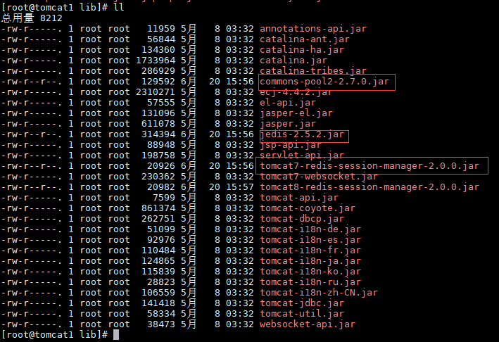
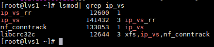
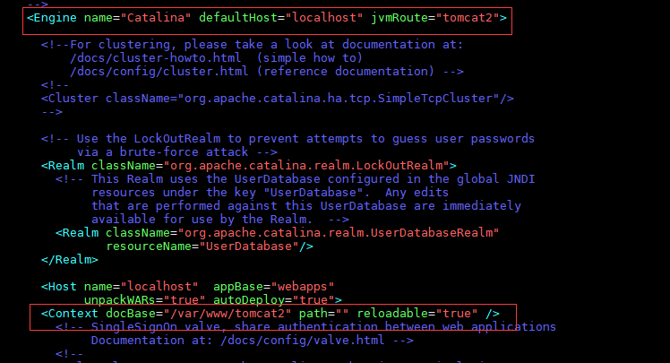
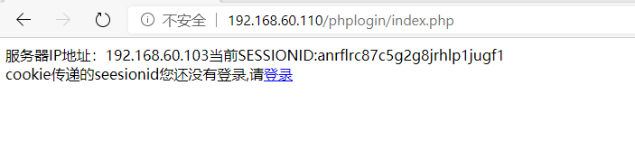
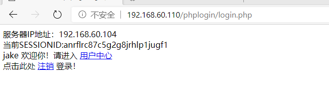

基于LVS、Nginx和Redis的多服务高可用负载均衡集群方案设计

**目 录**

[1、需求分析	4](#_Toc43620049)

>   [1.1、项目背景	4](#_Toc43620050)

>   [1.2、项目分析	4](#_Toc43620051)

[2、概要设计	5](#_Toc43620052)

>   [2.1、LVS技术分析	5](#_Toc43620053)

>   [2.2、LVS三层结构	5](#_Toc43620054)

>   [2.3、LVS性能优势分析	6](#_Toc43620055)

>   [2.4、LVS工作模式	6](#_Toc43620056)

>   [2.5、负载均衡模式	6](#_Toc43620057)

>   [2.6、调度算法	7](#_Toc43620058)

>   [2.7、KeepAlived分析	7](#_Toc43620059)

>   [2.8、多服务设计模式	7](#_Toc43620060)

>   [2.9、总体架构设计图	8](#_Toc43620061)

>   [2.10、部署准备	9](#_Toc43620062)

[3、系统实现	9](#_Toc43620063)

>   [3.1、环境搭建	9](#_Toc43620064)

>   [3.2、lvs+keepalived部署	11](#_Toc43620065)

>   [3.2.1、keepalived部署准备	11](#_Toc43620066)

>   [3.2.2、安装keepalived	12](#_Toc43620067)

>   [3.3、nginx部署	13](#_Toc43620068)

>   [3.3.1、部署准备	13](#_Toc43620069)

>   [3.3.2、安装nginx服务	14](#_Toc43620070)

>   [3.3.3、配置脚本	15](#_Toc43620071)

>   [3.3.4、nginx启动测试	18](#_Toc43620072)

>   [3.5、动静分离实现	19](#_Toc43620073)

>   [3.6、tomcat部署	20](#_Toc43620074)

>   [3.6.1、部署准备	20](#_Toc43620075)

>   [3.6.2、配置tomcat	21](#_Toc43620076)

>   [3.7、redis部署	22](#_Toc43620077)

>   [3.7.1、redis部署准备	22](#_Toc43620078)

>   [3.7.2、启动redis	24](#_Toc43620079)

>   [3.8、配置会话共享	24](#_Toc43620080)

>   [3.9、配置mysql主从复制	25](#_Toc43620081)

>   [3.9.1、配置server_id	25](#_Toc43620082)

>   [3.9.2、部署主从复制	26](#_Toc43620083)

>   [3.10、配置php的session共享	28](#_Toc43620084)

[4、系统测试	29](#_Toc43620085)

>   [4.1、负载均衡测试	29](#_Toc43620086)

>   [4.2、压力测试VIP节点	30](#_Toc43620087)

>   [4.3、tomcat测试	33](#_Toc43620088)

>   [4.3.1、设置tomcat虚拟主机	33](#_Toc43620089)

>   [4.3.2、在两台网站指定根目录下添加自定义测试文件	34](#_Toc43620090)

>   [4.4、测试session共享	36](#_Toc43620091)

>   [4.5、测试php的session共享	37](#_Toc43620092)

>   [4.6、高可用测试	39](#_Toc43620093)

[5、总结	43](#_Toc43620094)

# 1、需求分析

## 1.1、项目背景

伴随着信息技术的飞速发展，互联网技术发展突飞猛进，越来越多的业务依靠互联网来实现，当今计算机技术已进入以网络为中心的网络时代。数年来，随着国民经济的持续发展，人们的生活水平得以提高，网络用户的数量也随之一路攀升，加之国家的政策倡导，在许多偏远地区也能够实现网络覆盖，我国网民的数量已跻身世界前列。大量的服务和应用(如：新闻、电子商务、短视频等)都围绕着Web运行，加之我国网络服务性能的不断提升，网络产品的不断迭代与衍生，这就促使着网络用户剧烈增长并伴随着海量的网络数据流量。这给网络带宽和服务端带来了巨大的挑战，近几年网络服务也在不断的革新于发展，以华为为代表的第五代网络通信技术(5G)领跑世界，庞大的用户群体和先进的网络服务，使得我国网络技术的发展和前景良好。随着网络通信技术的不断升级，客户端的运行压力会不断的减小，去核心化的网络服务理念逐渐深入人心，更多的操作实现均来自于网络服务端，可以预见的是越来越多的技术瓶颈会出现在服务器端。如何建立一个高可用、高性价比、可扩展并且易管理的网络服务平台来满足不断增长的网络服务应用依然是网络发展的关键问题之一。在大数据时代实现一个高可用的网络设计方案已是服务端所不懈追求的目标。

## 1.2、项目分析

当今世界网络技术不断发展，用户数量不断攀升，每天都伴随着海量的数据的处理与应用，这些数据的产生与处理都离不开高性能的网络集群服务的支撑。传统的页面与数据库的交互设计模式已经不足以支撑如此庞大的用户数量，传统的数据处理技术已经无法应对海量数据的运算。这种情况下，基于Linux负载均衡的虚拟服务器集群技术应运而生，基于Linux的虚拟化服务器集群(建成LVS)，其实现目的是为了解决当下网络服务的瓶颈难题，创建一个具有高可用、可伸缩、易管理的基于Linux的负载均衡服务集群，来满足日益增长的网络服务需求。传统数据中心的运维管理是相当繁琐的，如：机器宕机、服务故障等，一系列问题都是通过运维人员手动实现，这一系列的操作考验的是网管员技术和体力的工作；但倘若使用了负载均衡方案使用KeepAlived后，在服务设计之初做好一系列的保障工作，对服务运行种所出现任何问题都做好事先的预案，当集群运行中出现故障后，会自动的调试平启用事先的预案，保障服务的稳定运行。这样的的高可用与负载均衡的解决方案既是网络数据中心运维的目标，也是网络发展的关键问题。

# 2、概要设计

## 2.1、LVS技术分析

LVS是Linux Virtual
Server的简称，即Linux虚拟服务器，是Linux标准内核的一部分，LVS的技术目标是：通过LVS提供的负载均衡技术和Linux操作系统的一个高性能、高可用的服务器集群，它具有良好的可靠性、可扩展性和可操作性，以廉价的成本实现最优的服务性能。LVS采用IP负载均衡技术和技术内容请求分析技术。调度器将请求负载转移到不同的服务器上执行，将一组服务器构成一个高性能、高可用的虚拟服务器。整个服务器集群的结构对客户是透明的，而且无需修改客户端和服务端的程序。

LVS体系结构图：

## 2.2、LVS三层结构

(1)负载调度器：是整个集群对外面的前端机，负载将客户的请求发送到一组服务器上执行。

(2)服务器池：是一组真正执行客户请求的服务器，可以是Web、Mail、Ftp和DNS服务器等。

(3)共享存储：它是服务器池提供一个共享的存储区，这样很容易使得服务器池拥有相同的内容，提供相同的服务，例如：数据库、分布式文件系统、网络存储等。

## 2.3、LVS性能优势分析

(1)高并发连接：LVS是基于内核网络层工作的，有着超强的承载能力和并发处理能力。单台LVS负载均衡器，可用支持上万并发连接。

(2)稳定性强：工作在网络层上仅作为分发使用，稳定性好，对内存和cpu资源消耗极低。

(3)成本低廉：硬件负载均衡器价格昂贵，而LVS只需要一台服务器就能够免费的部署使用，性价比高。

(4)配置简单：LVS配置仅需几行命令即可完成配置，也可实现脚本管理。

(5)支持多种算法调度：支持8种负载均衡算法，可根据业务场景灵活调配使用。

(6)支持多种工作模式：可根据业务场景，解决不同的问题，使用不同的工作模式。

(7)使用范围广：几乎可以对所有的应用做负载均衡，包括http、数据库、DNS等。

## 2.4、LVS工作模式

当客户端的请求到达负载均衡器的内核空间时，首先到达PREROUTING链，当内核发现请求数据包的目的地址是本机时，将数据包发送到INPUT链；LVS由用户空间ipvsadm和内核空间的IPVS组成，ipvsadm用来定义规则，IPVS利用ipvsadm定义的规则工作，IPVS工作在INPUT链上，当数据包到达INPUT时，首先会被IPVS调查，如果数据包里面的目的地址及端口没有在规则里面，那么这条数据就被放行到用户空间，如果数据包里面的目的地址及端口在规则里面，那么这条数据报文将被修正为事先定义好的后端服务器，并发往POSTOUTING链，最后由POSTROUTING链发往后端服务器。

## 2.5、负载均衡模式

LVS-NAT模式：是通过网络地址转换的方法来实现调度的。首先调度器(Director)接收到客户的请求数据包时（请求的目的IP为VIP），根据调度算法决定将请求发送给哪个后端的真实服务器（RS）。然后调度就把客户端发送的请求数据包的目标IP地址及端口改成后端真实服务器的IP地址（RIP）,这样真实服务器（RS）就能够接收到客户的请求数据包了。真实服务器响应完请求后，查看默认路由（NAT模式下我们需要把RS的默认路由设置为DS服务器。）把响应后的数据包发送给DS,DS再接收到响应包后，把包的源地址改成虚拟地址（VIP）然后发送回给客户端。

LVS-DR模式：用直接路由技术实现虚拟服务器｡当参与集群的计算机和作为控制管理的计算机在同一个网段时可以用此方法,控制管理的计算机接收到请求包时直接送到参与集群的节点｡直接路由模式比较特别，很难说和什么方面相似，前种模式基本上都是工作在网络层上，而直接路由模式则应该是工作在数据链路层上。

LVS-TUN模式：在TUN模式下，利用IP隧道技术将请求报文封装转发给后端服务器，响应报文能从后端服务器直接返回给客户。

FULL-NAT模式：FULL-NAT模式可以实际上是根据LVS-NAT模式的一种扩展。在NAT模式下DS需要先对请求进行目的地址转换(DNAT)，然后对响应包进行源地址转换（SNAT），先后进行两次NAT，而
FULL-NAT则分别对请求进行和响应进行DNAT和SNAT，进行4次NAT，当然这样多次数的NAT会对性能大大削减，但是由于对请求报文的目的地址和源地址都进行了转换，后端的RS可以不在同一个VLAN下。

## 2.6、调度算法

在内核中的连接调度算法上，IPVS已实现了以下八种调度算法：

轮叫调度rr、加权轮叫调度wrr、最小连接调度lc、加权最小连接调度wlc、基于局部性的最少链接LBLC、带复制的基于局部性最少链接LBLCR、目标地址散列调度DH、源地址散列调度SH。

## 2.7、KeepAlived分析

keepalived类似于layer3, 4 & 5交换机制的软件，
Keepalived的作用是检测服务器的状态，如果有一台web服务器宕机，或工作出现故障，Keepalived将检测到，并将有故障的服务器从系统中剔除，同时使用其他服务器代替该服务器的工作，当服务器工作正常后Keepalived自动将服务器加入到服务器群中，这些工作全部自动完成，不需要人工干涉，需要人工做的只是修复故障的服务器。

## 2.8、多服务设计模式

本次高可用与负载均衡设计，采用了多场景下的网站页面设计架构，支持HTML、PHP、JSP等多种页面访问模式，充分考虑了当先流行的网站设计体系，应用了Apache+Tomcat的两种访问方式，对其进行了nginx反向代理和动静分离，进行页面重定向和端口映射，有效的避免了访问限制，充分利用了高可用与负载均衡的资源访问模式，避免单点负载限制，使用了redis高效存储控制，应用了session共享的设计模式，使得页面的高效访问。使用了mysql数据库的主从复制与读写分离的存储模式，优化了存储效率，增加了高可用与负载均衡的高效性与稳定性，使用了廉价的机器设备，实现了高可用与负载均衡的访问控制机制。

## 2.9、总体架构设计图

## 2.10、部署准备

出于性能考虑，本次课程设计准备使用7台虚拟机实现上述设计。

环境介绍：

| 主机名  | IP             | 系统    | 部署应用                        |
|---------|----------------|---------|---------------------------------|
| Lvs1    | 192.168.60.111 | Centos7 | Lvs+keepalived                  |
| Lvs2    | 192.168.60.112 | Centos7 | Lvs+keepalived                  |
|         | 192.168.60.110 |         | VIP                             |
| Nginx1  | 192.168.60.101 | Centos7 | Nginx(静态页面)                 |
| Nginx2  | 192.168.60.102 | Centos7 | Nginx(静态页面)                 |
| Tomcat1 | 192.168.60.103 | Centos7 | Tomcat、Apache、Mysql(动态页面) |
| Tomcat2 | 192.168.60.104 | Centos7 | Tomcat、Apache、Mysql(动态页面) |
| Redis   | 192.168.60.105 | Centos7 | Redis(session会话共享)          |

版本设置：

| 软件包     | 版本    |
|------------|---------|
| Keepalived | 1.3.5   |
| Nginx      | 1.16.1  |
| Tomcat     | 7.0.104 |
| Jdk        | 1.8     |
| Apache     | 2.4.6   |
| Redis      | 5.0.5   |
| Mysql      | 5.7     |
| Ipvs       | 1.27    |

# 3、系统实现

## 3.1、环境搭建

准备7台虚拟机，使用最小化安装，分配1G内存+20G内存，预设好主机名与IP地址。

由于是最小化安装，一些常用插件工具没有安装上，需要手动下载安装。

\# yum install net-tools

\# yum install vim -y

## 3.2、lvs+keepalived部署

### 3.2.1、keepalived部署准备

关闭防火墙和selinux

\# systemctl stop firewalld

\# systemctl disable firewalld

\# setenforce 0

### 3.2.2、安装keepalived

\# yum install keepalived -y

修改keepalived配置文件，为例防止文件改坏，首先复制一份原版。

\# cp

/etc/keepalived/keepalived.conf /etc/keepalived/keepalived.conf.bak

\# vim keepalived.conf

## 3.3、nginx部署

### 3.3.1、部署准备

关闭防火墙和selinux

\# systemctl stop firewalld

\# systemctl disable firewalld

\# setenforce 0

为了防止nginx负载均衡调度器无法访问tomcat服务，这里设置关闭SElinux

\# vim /etc/selinux/config

SELINUX=disabled

为了方便安装，需要添加yum源

[aliyun]

name=aliyun epel

baseurl=http://mirrors.aliyun.com/epel/7Server/x86_64/

gpgcheck=0

### 3.3.2、安装nginx服务

\# yum install -y nginx

### 3.3.3、配置脚本

脚本用于节点服务器绑定VIP，抑制节点相应VIP的ARP请求。以此当关于VIP的ARP广播时，禁止节点服务器应答，这样就很好的保障了网络环境的通畅，因此，在打开nginx所在的服务器的路由功能、关闭ARP查询功能，并且设置回环ip，nginx1和nginx2配置脚本内容为：

\# vim /etc/rc.d/init.d/realserver.sh

\# chmod u+x /etc/rc.d/init.d/realserver.sh

\#!/bin/bash

VIP=192.168.60.110

/etc/rc.d/init.d/functions

case "\$1" in

start)

ifconfig lo:0 \$VIP netmask 255.255.255.255 broadcast \$VIP

/sbin/route add -host \$VIP dev lo:0

echo "1" \>/proc/sys/net/ipv4/conf/lo/arp_ignore

echo "2" \>/proc/sys/net/ipv4/conf/lo/arp_announce

echo "1" \>/proc/sys/net/ipv4/conf/all/arp_ignore

echo "2" \>/proc/sys/net/ipv4/conf/all/arp_announce

sysctl -p \>/dev/null 2\>&1

echo "RealServer Start OK"

;;

stop)

ifconfig lo:0 down

route del \$VIP \>/dev/null 2\>&1

echo "0" \>/proc/sys/net/ipv4/conf/lo/arp_ignore

echo "0" \>/proc/sys/net/ipv4/conf/lo/arp_announce

echo "0" \>/proc/sys/net/ipv4/conf/all/arp_ignore

echo "0" \>/proc/sys/net/ipv4/conf/all/arp_announce

echo "RealServer Stoped"

;;

\*)

echo "Usage: \$0 {start\|stop}"

exit 1

esac

exit 0

启动服务

\# /etc/rc.d/init.d/realserver.sh start

查看VIP信息：

### 3.3.4、nginx启动测试

首先进入nginx的配置文件查看网站根目录位置信息：

在根目录添加自定义网页用于测试：

\# echo "This is nginx1 web site."

\> /usr/share/nginx/html/default.html

\# echo "This is nginx2 web site."

\> /usr/share/nginx/html/default.html

然后启动nginx服务：

\# systemctl start nginx

访问站点网页查看nginx运行情况：

http://192.168.60.101/default.html

http://192.168.60.102/default.html

## 3.5、动静分离实现

修改两台nginx配置，实现负载均衡与动静分离。

\# vim /etc/nginx/nginx.conf

location \~ \\.(jsp\|do)\$ {

proxy_pass http://tomcat;

}

upstream tomcat {

server 192.168.60.103:8080 max_fails=3 fail_timeout=20s weight=2;

server 192.168.60.104:8080 max_fails=3 fail_timeout=20s weight=2;

}

## 3.6、tomcat部署

### 3.6.1、部署准备

为了保障页面的正常访问，首先在两台tomcat虚拟机关闭防火墙和selinux

\# systemctl stop firewalld

\# systemctl disable firewalld

\# setenforce 0

jdk安装部署

自行到java官网下载Jdk8版本到虚拟机，解压安装。

\# tar -zxvf jdk-8u144-linux-x64.tar.gz -C /usr/local/

\# mv jdk1.8.0_144/ jdk1.8

配置环境变量

\# vim /etc/profile

export JAVA_HOME=/usr/local/jdk1.8

export PATH=\$PATH:\$JAVA_HOME/bin

export CALSSPATH=.:\$JAVA_HOME/lib/tools.jar:\$JAVA_HOME/lib/dt.jar:\$CLASSPATH

\# source /etc/profile

同样的将tomcat2也添加上jdk，使用复制的方式添加。

\# scp -r /usr/local/jdk1.8 root\@192.168.60.104:/usr/local/

验证配置情况。

### 3.6.2、配置tomcat

下载tomcat安装包：

\# wget

https://mirror.bit.edu.cn/apache/tomcat/tomcat-7/v7.0.104/bin/apache-tomcat-7.0.104.tar.gz

\# tar -zxvf apache-tomcat-7.0.104.tar.gz -C /usr/local

重命名文件夹

\# mv /usr/local/apache-tomcat-7.0.104/ /usr/local/tomcat

将tomcat文件拷贝到tomcat2中。

\# scp -r /usr/local/tomcat root\@192.168.60.104:/usr/local/

## 3.7、redis部署

### 3.7.1、redis部署准备

关闭防火墙和selinux

\# systemctl stop firewalld

\# systemctl disable firewalld

\# setenforce 0

下载redis源码安装包，解压到/usr/loca/目录下。

\# wget http://download.redis.io/releases/redis-5.0.5.tar.gz

\# tar -zxvf redis-5.0.5.tar.gz -C /usr/local

由于redis是源码安装，所以要下载编译工具。

\# yum install -y gcc gcc-c++ make

移动到redis根目录下编译安装。

\# make && make install

初始化redis

\# cd utils/

\# ./install_server.sh

初始化成功后，redis文件会连接到/etc目录下，其中：

(1)配置文件为/etc/redis/6379.conf

(2)日志文件问/var/log/redis_6379.log

(3)数据文件dump.rdb存放到/var/lib/redis/6379目录下

(4)启动脚本为/etc/init.d/redis_6379

接下来需要设置redis的启动脚本到系统变量中。

[Unit]

Description=Redison port 6379

[Service]

Type=forking

ExecStart=/etc/init.d/redis_6379 start

ExecStop=/etc/init.d/redis_6379 stop

[Install]

WantedBy=multi-user.target

### 3.7.2、启动redis

修改配置文件

\# vim /etc/redis/6379.conf

bind 127.0.0.1 192.168.60.105

requirepass pwd\@123

启动redis服务

\# systemctl restart redis_6379.service

## 3.8、配置会话共享

下载tomcat-redis-session-manager相应的jar包，将其拷贝到两台tomcat根目录的lib目录下。

修改tomcat的context.xml文件

\# vim /usr/local/tomcat/conf/context.xml

\<Valve
className="com.orangefunction.tomcat.redissessions.RedisSessionHandlerValve"/\>

\<Manager
className="com.orangefunction.tomcat.redissessions.RedisSessionManager"

host="192.168.60.105"

password="password\@123"

port="6379"

database="0"

maxInactiveInterval="60"

/\>

## 3.9、配置mysql主从复制

设tomcat1为mysql-master节点，tomcat2为mysql-slave节点进行配置。在两台tomcat上配置mysql读写分离，使用yum的形式手动安装mysql数据库，启动数据库，修改初始化密码：

\# mysqladmin -u root password 123456

### **3.9.1、配置server_id**

\# vim /etc/my.cnf

重启两台tomcat的Mysql服务，查看service_id的状态信息。

\# systemctl restart mysqld

\# show variables like 'server_id';

### 3.9.2、部署主从复制

在mysql-master上建立slave复制账号

mysql\> CREATE USER 'slave'\@'%' IDENTIFIED BY '123';

mysql\> GRANT REPLICATION SLAVE,RELOAD,SUPER ON \*.\* TO slave\@'%' IDENTIFIED
BY '123';

mysql\>show grants for slave\@'%';

mysql\>flush privileges; \#刷新权限

在master创建并备份temp数据库，拷贝到slave

mysql\>create database temp;

mysql\>use temp;

mysql\> create table users(user_name char(16) not null,user_passwd char(48)
default "",primary key(user_name));

mysql\>insert into users(user_name,user_passwd) values ("zhangsan","123");

\# mysqldump -u root -p temp \> /root/tempdata.sql

在mysql-slave恢复数据库temp。

mysql\>create database temp;

在mysql-master上查看master配置信息

在mysql-slave配置复制参数 ，启动复制，查看复制状态。

mysql\> change master to master_host='192.168.60.103', master_user='slave',
master_password='123', master_log_file='mysql-bin.000002', master_log_pos=120,
master_connect_retry=30;

mysql\> start slave;

mysql\> show slave status \\G

## 3.10、配置php的session共享

在mysql-master的temp数据库上创建表再插入数据。

mysql\> create table user(uid int(4),username char(16) not null,password
char(48) default "",primary key(username));

mysql\>insert into user(uid,username,password) values (1,"tom",MD5("123"));

在mysql-slave数据库中查看插入信息。

可以看到mysql的读写分离测试成功。

自定义一个php网站页面，移动到apache网站的根目录。

# 4、系统测试

## 4.1、负载均衡测试

启动服务

\# systemctl start keepalived

\# systemctl enable keepalived

查看VIP情况判定是否配置成功，lvs1(master)有而lvs2(backup)节点没有。

\# ip addr 使用ifconfig是不显示的

此时，lvs1处于开启状态，lvs2处于待机状态，表示配置成功。

## 4.2、压力测试VIP节点

首先查看lvs机器是否安装启用了ipvsadm命令，正常情况是伴随keepalived的安装的启动运行的一个工具。ipvsadm是一个管理ipvs的工具。

\# lsmod\| grep ip_vs 查看是ipvs模块是否加载成功

若没安装成功则使用yum安装上：

\# yum install ipvsadm -y

在另外的一台虚拟机执行压力测试命令

\# ab -c 1000 -n 1000 http://192.168.60.110/default.html

在lvs1上查看节点数据流量，lvs2模式是backup模式，是没有数据经过的，采取的是rr轮询的方式。

## 4.3、tomcat测试

### 4.3.1、设置tomcat虚拟主机

\# vim /usr/local/tomcat/conf/server.xml

修改默认虚拟主机，并将网站路径指向/var/www/tomcat1/

\# mkdir p /var/www/tomcat1

tomcat2也是类似的操作。

\# mkdir p /var/www/tomcat2

### 4.3.2、在两台网站指定根目录下添加自定义测试文件

\<%\@page language="java" import="java.util.\*" pageEncoding="UTF-8"%\>

\<html\>

\<head\>

\<title\>tomcat1\</title\>

\</head\>

\<body\>

\<h1\>\Session serviced by tomcat\</font\>\</h1\>

\<table aligh="center" border="1"\>

\<tr\>

\<td\>Session ID\</td\>

\<td\>\<%=session.getId() %\>\</td\>

\<% session.setAttribute("abc","abc");%\>

\</tr\>

\<tr\>

\<td\>Created on\</td\>

\<td\>\<%= session.getCreationTime() %\>\</td\>

\</tr\>

\</table\>

\</body\>

\<html\>

在两台tomcat虚拟机启动tomcat测试，验证负载均衡。

\# /usr/local/tomcat/bin/startup.sh

使用主机浏览器访问VIP的index.jsp页面，不停的刷新可用看到页面的转换。

由此实现了lvs+nginx+tomcat的高可用负载均衡测试。

## 4.4、测试session共享

配置完tomcat和redis配置后，重新启动redis和tomcat，在浏览器访问VIP的指定网页查看session

回到redis客户端页面查看缓存内存中的session数据。

可以看到显示的session一致，表示session共享配置成功。

## 4.5、测试php的session共享

在nginx的配置文件添加修改如下配置，使得.html和.php文件重定向到两台tomcat服务器地址。

upstream app {

server 192.168.60.103;

server 192.168.60.104;

}

location \~ \\.(php\|html)\$ {

proxy_pass http://app;

}

在主机浏览器访问http://192.168.60.110/phplogin/index.php页面。

采用的是轮询的方式(rr)访问两台tomcat虚拟机，可以看到网页的服务器IP地址在变化，而session并未改变。

再测试验证mysql主从复制读写分离的实现。

从mysql-master(192.168.60.103)中向数据库temp的user表写入数据：

\# insert into user(uid,username,password) values (1,"jake",MD5("123456"));

修改php登录页面的数据库访问信息，使其访问mysql-slave的temp数据库。

再次使用浏览器访问php的登录页面，使用jake和123456用户登录。

由此可知mysql主从复制读写分离配置成功。

## 4.6、高可用测试

对lvs1和nginx1进行宕机测试，首先在各个服务正常运行的情况下，手动停止keepalived1和nginx1查看服务的访问情况。

停止keepalived1和nginx1

查看lvs和nginx服务器的IP

站点依然可以正常访问

对宕机后的高可用集群进行压力测试。

\# ab -c 1000 -n 1000 http://192.168.60.110/index.jsp

使用ipvs工具在Lvs2上查看连接情况。

可以看到只有一台lvs服务器正常运转，页面仍然可用正常运转，下面启用着两个被宕机的服务器。

可用看到服务正常启动，表明lvs+nginx高可用与负载均衡配置、php和tomcat的session共享机制以及mysql主从复制读写分离的配置成功。

# 5、总结

通过对高可用与负载均衡课程的学习，我学到了很多关于服务器集群搭建与运维方面的知识和技能，对服务器运维领域有了更深层次的学习和理解。通过完成这个项目，使得我对Lvs、Nginx高可用架构有了整体的了解，Lvs、Nginx高可用与负载均衡集群是当前服务器部署与应用中应用最为广泛的服务器集群建设方式。对海量的数据进行处理的能力远超传统的服务器搭建模式，能够独立的处理高并发与高负载的大规模网站服务建设，有效的排除了单点故障所带来的网络瘫痪危机，实现了Lvs、Keepalived和Nginx的高可用访问控制，以及Apache和Tomcat多页面场景下的网站类型的动静分离与高效访问，同时还包括Mysql主从复制与读写分离的高效存储设计与实现，使得能够对服务器长期、稳定、高效的运行提供可靠保障。

非常感谢老师能够给我这次机会，然我能够独立的完成一个多场景的高可用与负载均衡集群的部署与应用的过程，以此来结合所学的知识对我之前学到的知识有了更深层次的立即与感悟，对今后的学习与工作有着极其重要的意义。
